# Sentimaniac

[](https://www.python.org/)
[](https://scikit-learn.org/)
[](https://pandas.pydata.org/)
[](https://numpy.org/)

[](https://numpy.org/)
[](https://numpy.org/)

[](https://numpy.org/)
[](https://numpy.org/)


🎉 Welcome to Sentimaniac - a Python Machine Learning project for analyzing sentiment with flair! 🚀

## Overview

Sentimaniac is an exciting project that harnesses the power of Python's robust machine learning libraries to analyze sentiment. With this project, you'll dive into the world of natural language processing (NLP) and explore how to classify sentiments in text data.

## Features

- **Dataset Usage**: Utilize a rich dataset to train your sentiment analysis model.
- **Efficient Data Handling**: Leverage the power of Pandas and NumPy for efficient data manipulation and preprocessing.
- **Scikit-Learn Integration**: Train your sentiment classifier with ease using the renowned Scikit-Learn library.
- **Interactive Visualization**: Visualize your model's performance and insights with beautiful plots generated using Matplotlib.

---


## Table of Contents

- [Overview](#overview)
- [Features](#features)
- [Section 1: Engaging "For Investors"](#section-1-engaging-for-investors)
  - [Practical Potential of the Project](#practical-potential-of-the-project)
  - [Unique Advantages and Possibilities](#unique-advantages-and-possibilities)
  - [Real-World Application Scenarios and Economic Benefits](#real-world-application-scenarios-and-economic-benefits)
  - [Visuals and Success Stories](#visuals-and-success-stories)
- [Section 2: Technical "For Developers"](#section-2-technical-for-developers)
  - [Developer-Friendly Documentation](#developer-friendly-documentation)
  - [Interesting Technical Aspects Related to Python](#interesting-technical-aspects-related-to-python)
  - [Data Flow Diagram](#data-flow-diagram)
  - [Code Examples and Explanations](#code-examples-and-explanations)
  - [Libraries and Technologies Used](#libraries-and-technologies-used)
  - [Example Code Fragments and Explanations](#example-code-fragments-and-explanations)
  - [Datasets Used](#datasets-used)
- [Section 3: Scientific "For Researchers"](#section-3-scientific-for-researchers)
  - [Theoretical Aspects of the Project](#theoretical-aspects-of-the-project)
  - [Explanation of Used Models](#explanation-of-used-models)
  - [Visual Showcase of Model's and Dataset's Content](#visual-showcase-of-models-and-datasets-content)
  - [Feature Importance](#feature-importance)
- [Section 4: Graphs and Charts](#section-4-graphs-and-charts)
  - [Graphs](#graphs)
  - [Word Clouds](#word-clouds)


---


## Section 1: Engaging "For Investors"

### Practical Potential of the Project

Our project leverages advanced machine learning algorithms to provide breakthrough solutions in data analysis. By utilizing powerful predictive models, we can accurately forecast market trends, enabling more informed and profitable investment decisions. This innovation represents a significant leap forward in the realm of data-driven investment strategies.

#### Unique Advantages and Possibilities

This project is designed to offer unique advantages, such as:
- High accuracy in sentiment analysis of social media data.
- Scalable and adaptable models for various datasets.
- Integration capabilities with existing investment analysis tools.

#### Real-World Application Scenarios and Economic Benefits

Imagine being able to predict market sentiment with unprecedented precision. Our project can analyze vast amounts of social media data to gauge public opinion on stocks, products, or entire markets, leading to smarter investment strategies and higher returns. The potential economic benefits include improved investment performance and reduced risk exposure.

#### Visuals and Success Stories

We have included graphical representations of our model’s performance and case studies showcasing successful applications of our technology. For example, our sentiment analysis model achieved an accuracy on validation data, demonstrating its robustness and reliability.

#### Below you can see how many Tweets and Redit posts regarding companies are created by people on daily basis.

---

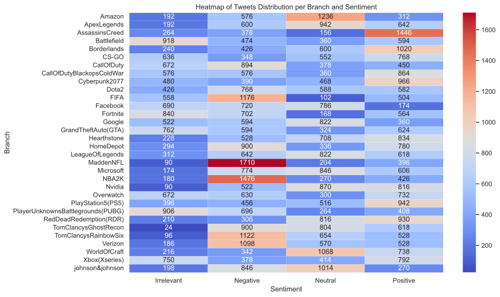

---


## Section 2: Technical "For Developers"

### Developer-Friendly Documentation

This documentation is written to be easily understandable by fellow developers. It provides insights into the technical aspects of the project, making it easier to integrate and modify the code as needed.

#### Interesting Technical Aspects Related to Python

Our project makes extensive use of Python's powerful libraries for data manipulation, machine learning, and visualization. Key libraries include pandas, scikit-learn, and nltk.

#### Data Flow Diagram

Below is a diagram representing the flow of data through our system:

```plaintext
CSV Data ➔ Data Cleaning ➔ Data Analysis ➔ Feature Extraction ➔ Model Training ➔ Evaluation
```

#### Code Examples and Explanations

**Data Loading and Cleaning:**
```python
import pandas as pd
import re
from nltk.corpus import stopwords
from nltk.tokenize import word_tokenize

# Load data
train_data = pd.read_csv("twitter_training.csv", encoding='utf-8', header=None)
train_data = train_data.dropna()

# Data cleaning
train_data["lower"] = train_data[1].str.lower()  # Lowercase conversion
train_data["lower"] = train_data["lower"].apply(lambda x: re.sub('[^A-Za-z0-9 ]+', ' ', x))  # Remove special characters
```

**Feature Extraction:**
```python
from sklearn.feature_extraction.text import CountVectorizer

# Initialize CountVectorizer
bow_counts = CountVectorizer(tokenizer=word_tokenize, stop_words=stopwords.words('english'))

# Transform data
X_train_bow = bow_counts.fit_transform(train_data["lower"])
```

**Model Training and Evaluation:**
```python
from sklearn.linear_model import LogisticRegression
from sklearn.metrics import accuracy_score

# Train model
model = LogisticRegression(C=1, solver="liblinear", max_iter=150)
model.fit(X_train_bow, train_data['sentiment'])

# Evaluate model
test_pred = model.predict(X_test_bow)
print("Accuracy: ", accuracy_score(y_test_bow, test_pred) * 100)
```

#### Libraries and Technologies Used
- **pandas**: Data manipulation and analysis
- **nltk**: Natural language processing
- **scikit-learn**: Machine learning algorithms and evaluation metrics
- **xgboost**: Advanced gradient boosting algorithms
- **pickle**: Model serialization and deserialization

#### Example Code Fragments and Explanations
```python
import pickle

# Save model
filename = 'sentimaniac.pkl'
pickle.dump(model, open(filename, 'wb'))

# Load model
loaded_model = pickle.load(open('sentimaniac.pkl', 'rb'))
```

#### Datasets Used
Our project utilizes datasets comprising social media posts with labeled sentiments. Here are some examples from our datasets:

**Training Data:**
[twitter_training.csv](datasets/twitter_train.csv)

```
head twitter_training.csv
2401,Borderlands,Positive,"im getting on borderlands and i will murder you all ,"
2401,Borderlands,Positive,"I am coming to the borders and I will kill you all,"
2401,Borderlands,Positive,"im getting on borderlands and i will kill you all,"
2401,Borderlands,Positive,"im coming on borderlands and i will murder you all,"
2401,Borderlands,Positive,"im getting on borderlands 2 and i will murder you me all,"
2401,Borderlands,Positive,"im getting into borderlands and i can murder you all,"
```

**Validation Data:**
[twitter_validation](datasets/twitter_validation.csv)
```
head twitter_validation.csv
3364,Facebook,Irrelevant,"I mentioned on Facebook that I was struggling for motivation to go for a run the other day, which has been translated by Tom’s great auntie as ‘Hayley can’t get out of bed’ and told to his grandma, who now thinks I’m a lazy, terrible person 🤣"
352,Amazon,Neutral,BBC News - Amazon boss Jeff Bezos rejects claims company acted like a 'drug dealer' bbc.co.uk/news/av/busine…
8312,Microsoft,Negative,@Microsoft Why do I pay for WORD when it functions so poorly on my @SamsungUS Chromebook? 🙄
4371,CS-GO,Negative,"CSGO matchmaking is so full of closet hacking, it's a truly awful game."
4433,Google,Neutral,Now the President is slapping Americans in the face that he really did commit an unlawful act after his  acquittal! From Discover on Google vanityfair.com/news/2020/02/t…
6273,FIFA,Negative,"Hi @EAHelp I’ve had Madeleine McCann in my cellar for the past 13 years and the little sneaky thing just escaped whilst I was loading up some fifa points, she took my card and I’m having to use my paypal account but it isn’t working, can you help me resolve it please?"
7925,MaddenNFL,Positive,"Thank you @EAMaddenNFL!! 
```

## Section 3: Scientific "For Researchers"

### Theoretical Aspects of the Project

Our project employs various theoretical concepts in machine learning, such as cross-validation and feature importance. Cross-validation allows us to evaluate the model’s performance more reliably by splitting the dataset into multiple training and testing sets, thus reducing overfitting and providing a more accurate measure of the model’s effectiveness.

#### Explanation of Used Models

We utilized logistic regression and XGBoost classifiers for sentiment analysis. Logistic regression is a simple yet powerful linear model used for binary classification, while XGBoost is a more advanced ensemble learning technique known for its high performance and efficiency in handling large datasets.

**Logistic Regression:**
Logistic regression models the probability of a binary outcome based on one or more predictor variables. It is widely used for its simplicity and interpretability.

**XGBoost:**
XGBoost is an optimized distributed gradient boosting library designed to be highly efficient, flexible, and portable. It implements machine learning algorithms under the Gradient Boosting framework, providing parallel tree boosting (also known as GBDT, GBM) that solves many data science problems in a fast and accurate way.

---

### Visual showcase of model's and dataset's content

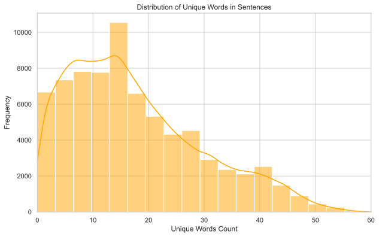
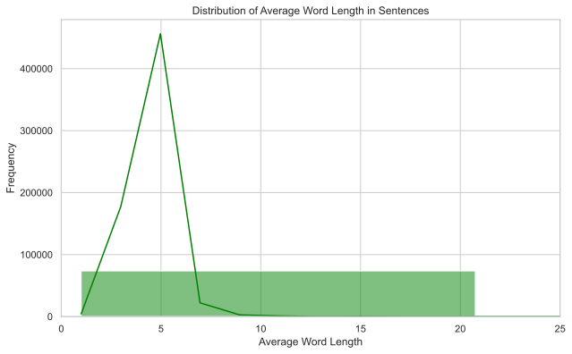
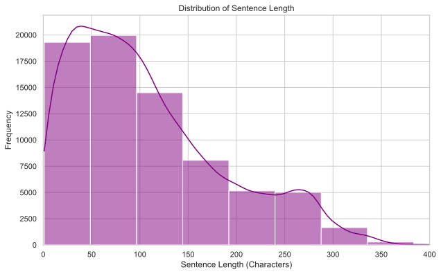
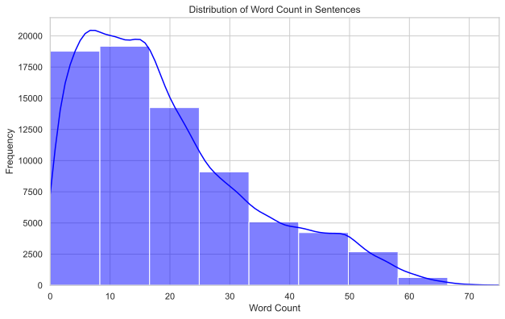


#### Feature Importance

Feature importance analysis helps us understand which variables have the most significant impact on the model's predictions. This is crucial for interpreting the model and improving its performance.

```python
from sklearn.ensemble import RandomForestClassifier

# Train model to get feature importances
rf_model = RandomForestClassifier()
rf_model.fit(X_train_bow, y_train_bow)

# Get feature importances
importances = rf_model.feature_importances_
```

By focusing on the most important features, we can enhance the model’s accuracy and reduce computational costs.


---


## Section 4: Graphs and Charts

### Graphs
#### Here are some visualisations to better understand the data and model used.

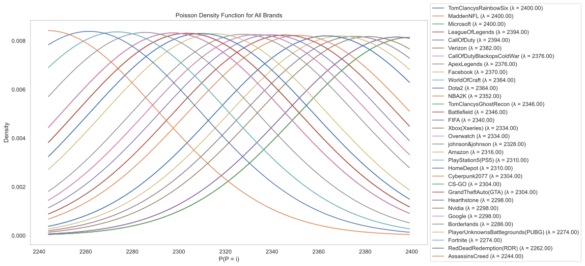
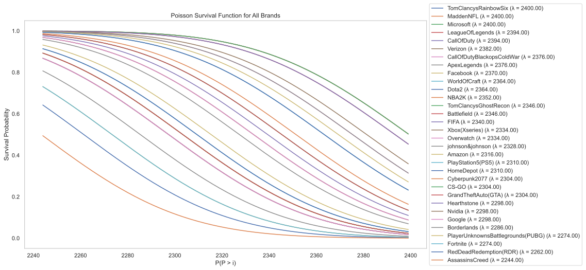
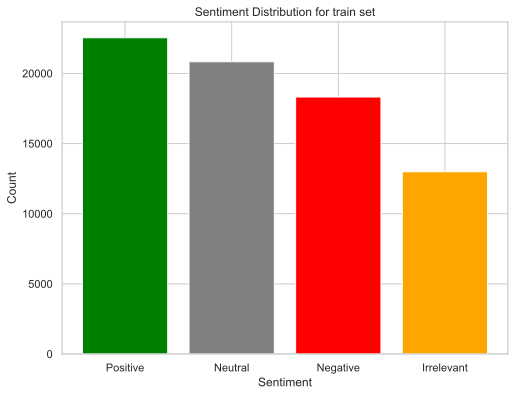
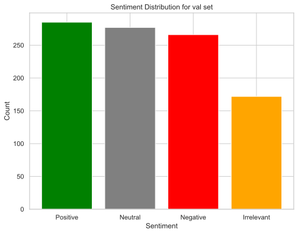
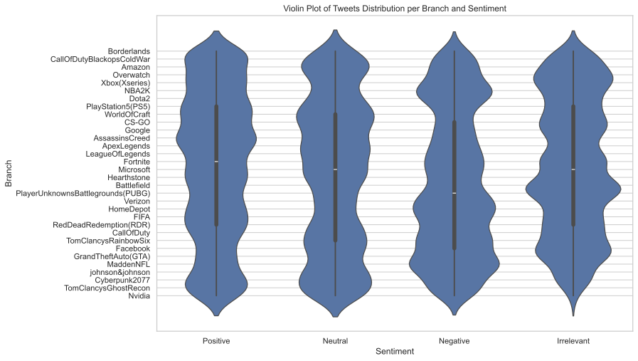

### Word Clouds

#### Positive


#### Neutral
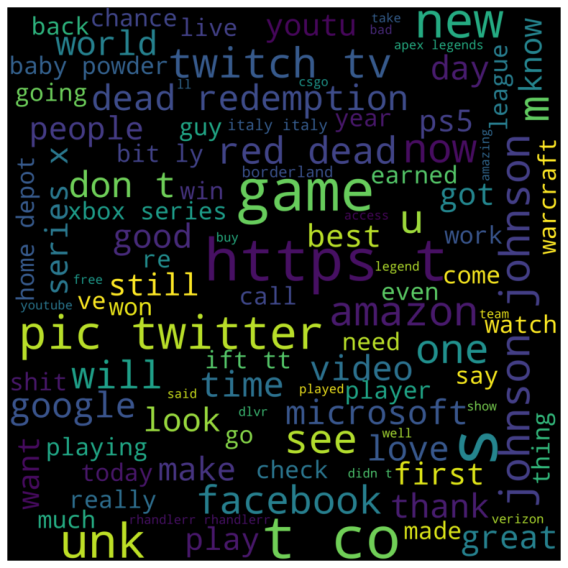

#### Negative
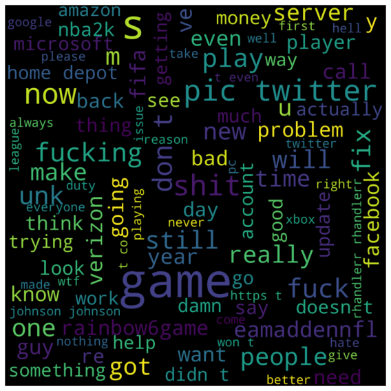

#### Irrelevant


---

#### We all hope you enjoyed the journey and feel free to contact us if needed!

This is [Me](https://github.com/34panda), co-creator of this magnificent project!
